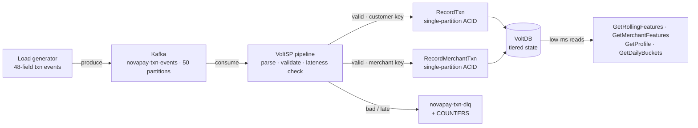

# Real-Time Feature Store — Kafka → VoltSP → VoltDB

**A reference demo for real-time feature computation and serving in fraud & risk decisioning.**
Every transaction becomes a single ACID transaction the instant it lands — no micro-batch, no
reconciliation — and rolling-window features stay exact and *decay on time* as the window slides.

> **Scenario (fictional):** *NovaPay* is a fictional national digital-payments platform, used purely
> as an illustrative persona. Any resemblance to real companies is coincidental. The workload shape,
> volumes, and requirements model a realistic high-throughput payments fraud / feature-store use case.

---

## Why this exists

The common feature-store pattern — **stream micro-batch (e.g. Spark) + a wide-column store (e.g.
Cassandra)** — runs into four structural limits when it feeds *real-time* fraud decisions:

1. **Same-second blind spot.** A payment made in the same second as a fraud check is invisible to it — the batch hasn't run yet.
2. **Reconciliation as a fixture.** Two systems drift; a repair pass exists permanently, just to make the numbers trustworthy.
3. **Feature velocity.** Shipping one of ~250 feature definitions is an engineering project, not a configuration change.
4. **Operational footprint.** Multiple always-on systems, each with its own capacity plan.

This demo collapses **compute and store into one in-memory, transactional tier**. Windows become
query-time sums over event-time buckets, so they stay exact and evict themselves — nothing to reconcile.

## Architecture



**Tiered data model** — storage follows measured event frequency:

| Tier | Table | Retention | Serves |
|---|---|---|---|
| Customer **hot** | `TXN_RAW` | 7 d | Exact aggregates from raw events, any window granularity |
| Customer **warm** | `CUSTOMER_DAILY` | 90 d | Long windows: live leading edge, day-granular trailing edge |
| Customer **lifetime** | `CUSTOMER_PROFILE` | ∞ | Lifetime attributes + a materialized derived `avg_ticket` |
| Merchant | `MERCHANT_MINUTE` + `MERCHANT_TXN_SEEN` | 7 d / 48 h | Minute-exact merchant windows (minute buckets pay off ~50:1 here) |
| Ingest hygiene | `COUNTERS` + `novapay-txn-dlq` | — | Unparseable / mis-keyed / late events — dead-lettered **and counted**, never silently dropped |

## What this demo proves

| Requirement | How it's shown |
|---|---|
| **Sub-second freshness** | Every event queryable milliseconds after Kafka; consumer lag stays ~0 at peak |
| **Windows that decay on time** | A rolling "last N minutes" shrinks as time passes with no new event |
| **Full aggregator vocabulary** | Filtered sum/count/min/max, exact count-distinct, composite-filter features in one call |
| **Minute precision where it matters** | Second subject key (merchant) on minute buckets; customers kept exact on raw |
| **Low-ms reads under write load** | Single-partition feature reads served from memory during peak ingest |
| **Peak throughput** | 15,000 events/sec sustained without the consumer falling behind |
| **Ingest integrity** | Dedupe (retries never double-count) + dead-letter + lateness bound, all counted |

## Components (one buildable module)

- **Load generator** (`TxnLoadGenerator`) — realistic 48-field payment events onto Kafka, with an event-type mix, hot-merchant skew, and injected edge cases (bad timestamps, missing keys, late events, retries).
- **VoltSP pipeline** (`TxnFeaturePipeline`) — consumes Kafka, validates the contract, turns each valid event into two single-partition ACID transactions (customer + merchant), dead-letters the rest.
- **VoltDB stored procedures** — `RecordTxn`, `RecordMerchantTxn`, `BumpCounter` (writes); `GetRollingFeatures`, `GetMerchantFeatures`, `GetProfile`, `GetDailyBuckets`, `GetRecentTxns`, `GetCounters` (reads).
- **Query bench** (`FeatureQueryBench`) — mixed hot/warm/merchant reads with latency percentiles.
- **Operator Console** (`ui/`, optional) — a React + TypeScript console: architecture map, schema, SQL, feature explorer, ingest hygiene, benchmarks, sizing, a demo runbook, and a **Demo Control** page to start/stop load and reset the whole demo from the browser.

## Quick start (laptop / single node)

You need **JDK 21**, **Maven**, a **Kafka** kit, a **VoltDB (Enterprise)** kit, a **VoltSP** kit, and an
Enterprise **trial license** (see below).

```bash
cp settings.env.example settings.env      # point it at your kits + license
# one-time: install the Volt jars from your kits into ~/.m2 (see docs/DEPLOYMENT.md)
mvn -q -DskipTests package                 # builds the fat jar + procedures jar

./scripts/01_create_topic.sh               # create topics
./scripts/02_start_voltdb.sh               # start VoltDB
./scripts/03_deploy_schema.sh              # deploy schema + procedures
./scripts/04_run_pipeline.sh               # terminal 1 — VoltSP ingest (start BEFORE loadgen)
./scripts/05_run_loadgen.sh 2000           # terminal 2 — 2,000 events/sec
./scripts/06_run_querybench.sh 500         # terminal 3 — 500 reads/sec (optional)
```

Full step-by-step for **laptop, single VM, one-VM-per-component, Kafka/VoltDB clusters, and Docker** is
in **[docs/DEPLOYMENT.md](docs/DEPLOYMENT.md)**. The presenter walk-through is in
**[docs/RUNBOOK.md](docs/RUNBOOK.md)**; the deeper "why / what it proves" is in
**[docs/CONTEXT.md](docs/CONTEXT.md)**.

## 🔑 You need a Volt Active Data trial license

VoltDB and VoltSP are commercial products. To build and run this demo, **request a free Enterprise
trial from Volt Active Data** at **[voltactivedata.com](https://www.voltactivedata.com/)** and download
the VoltDB and VoltSP kits. Point `settings.env` at the kits and the license file. License files are
git-ignored — never commit them.

## Repository layout

```
pom.xml                        one Maven module → fat jar + procedures jar
settings.env.example           single edit-once config (copy to settings.env)
scripts/00_env.sh              env loader sourced by every script
scripts/01..06_*.sh            create topic · start db · deploy · pipeline · loadgen · querybench
src/main/java/com/novapay/poc  pipeline · procedures · loadgen · query bench
src/main/resources             ddl.sql (batched) · remove_db.sql · queries.sql
config/pipeline-config.yaml    VoltSP runtime config (env-driven)
deploy/                        VoltDB deployment template (sites-per-host / cluster)
docker/                        docker-compose + Dockerfile (reference container topology)
ui/                            optional operator console (React + BFF)
docs/                          DEPLOYMENT · RUNBOOK · CONTEXT
```

---

## The tier design — driven by measured event frequency

Customers transact ~1 event per minute at most (a few per day); busy merchants receive up to ~50 events
per minute. Minute buckets compress nothing for customers (measured ~0.94 buckets/event) but ~50:1 for
merchants. So the customer path keeps **raw events** (exact, any granularity) plus **daily buckets** for
long windows, while the merchant path uses **minute buckets** — the one place minute buckets earn their RAM.

The reference requirements this demo is validated against use `§`-numbered sections (schema/ingest
contract, subject keys, attribute set, volumes & sizing). Those `§` references appear in code comments as
traceability markers; they name a requirements spec, not any real organization.

## Sizing & measurement (§8)

- Numeric long `customer_id`, ~12 digits; 50 source partitions; 10M default distinct subjects; ~1.5 KB / 48-field events.
- Longest window 30 d (warm tier); 15K eps peak via `./scripts/05_run_loadgen.sh 15000`.
- Measure bytes/subject from live statistics:

```bash
"$VOLTDB_HOME"/bin/sqlcmd --query="exec @Statistics TABLE 0" | \
  awk '/PersistentTable/ {cnt[$6]+=$8; data[$6]+=$10; str[$6]+=$11}
       END {for (t in cnt) printf "%s rows=%d bytes/row=%.0f\n", t, cnt[t], (data[t]+str[t])*1024/cnt[t]}'
```

Per-subject memory = raw rows×bytes (7 d) + daily rows×bytes (90 d) + 1 profile row.

## Precision statement

Windows ≤ 7 days: exact to the second. Windows > 7 days: leading edge live, trailing edge advances at
**day** granularity — for a 30-day SUM the trailing day holds ~3% of the value. Any feature needing
full-span minute precision can be pinned to a minute-bucket table at a known per-feature RAM cost (the
merchant tier is the worked example of exactly that pinning).

## Roadmap (next phase)

Runtime feature-definition registry, segments with join/leave events, CEP patterns, and
percentile / HLL sketches. All are additive on these tables and this ingest transaction.

---

## License & disclaimer

Provided as a reference for evaluating Volt Active Data products; it requires VoltDB / VoltSP kits and a
valid license to run. "NovaPay", the transaction data, and the named scenario are entirely fictional.
